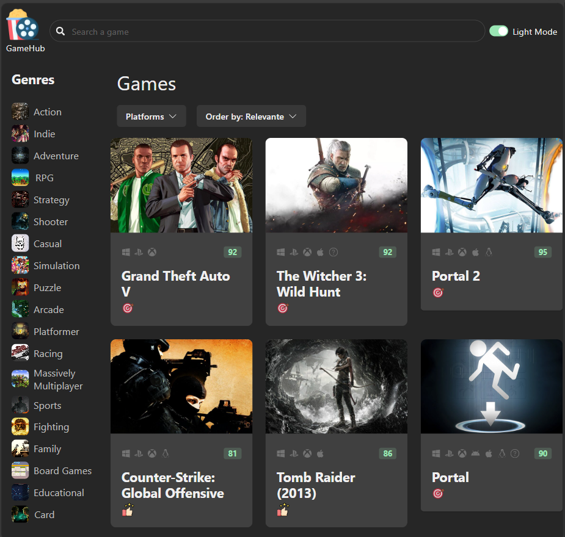
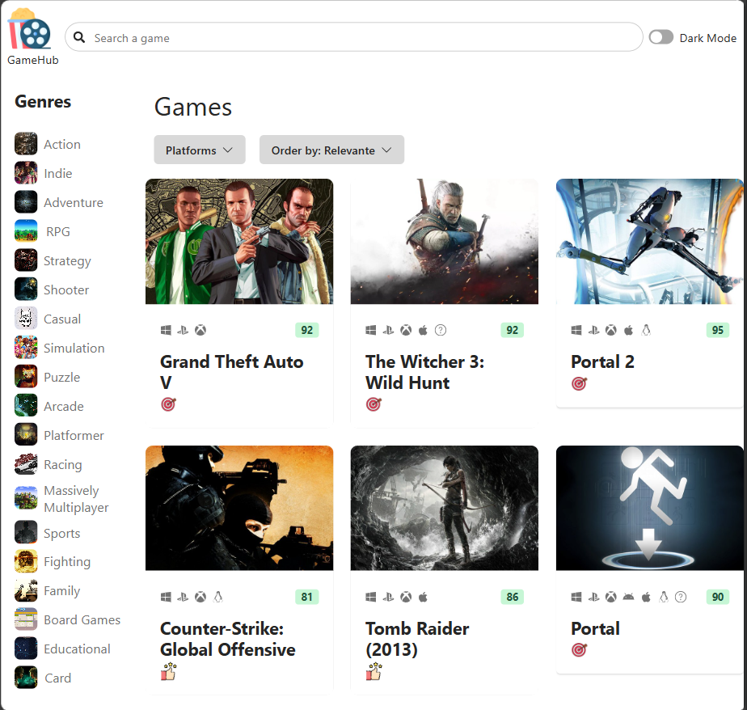

# Gamehub

## Description

React application built on top rawg.io data.


## The Landing page

<div class="img-container">
  <figure>
  <figcaption>Dark version of the application</figcaption>
  
  </figure>
  <figure>
  <figcaption>Light version of the application</figcaption>
  
  </figure>
</div>

## How build docker image

```bash
  docker build -f .docker/Dockerfile -t ghcr.io/kvruntime/gamehub:dev .
  docker build -f .docker/Dockerfile.prod -t ghcr.io/kvruntime/gamehub:prod .
```

ghcr.io/username/repo:tag

```bash
  docker tag gamehub:dev ghcr.io/kvruntime/gamehub:dev 
```
